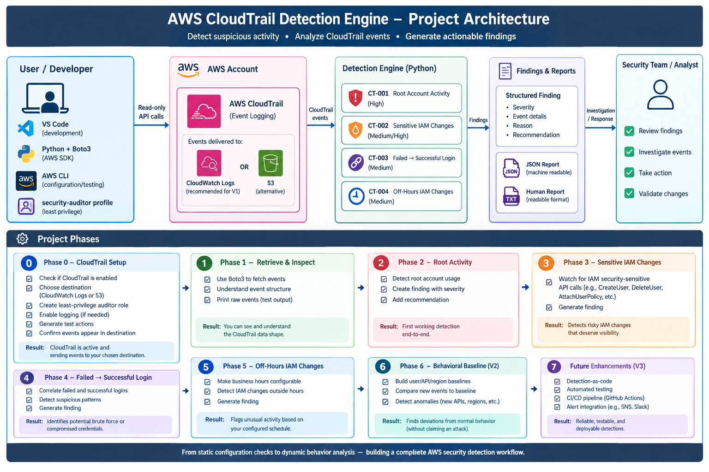
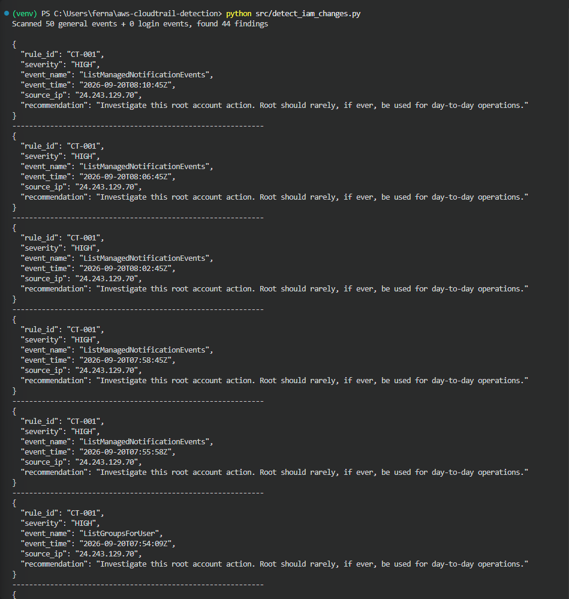
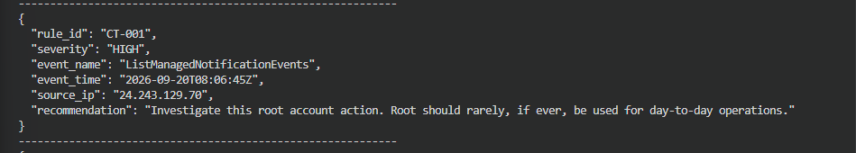
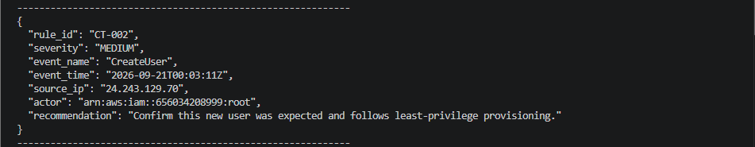
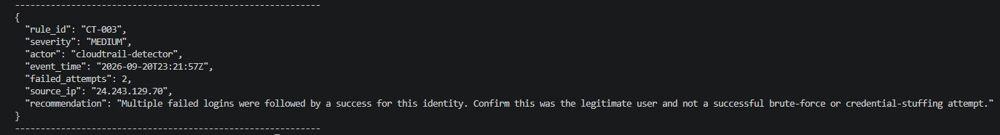
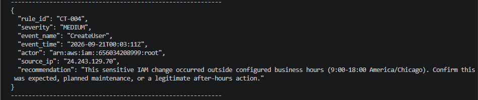
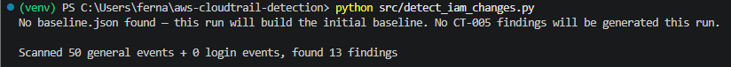
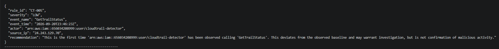
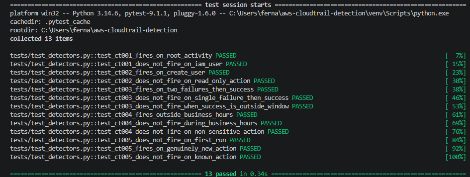
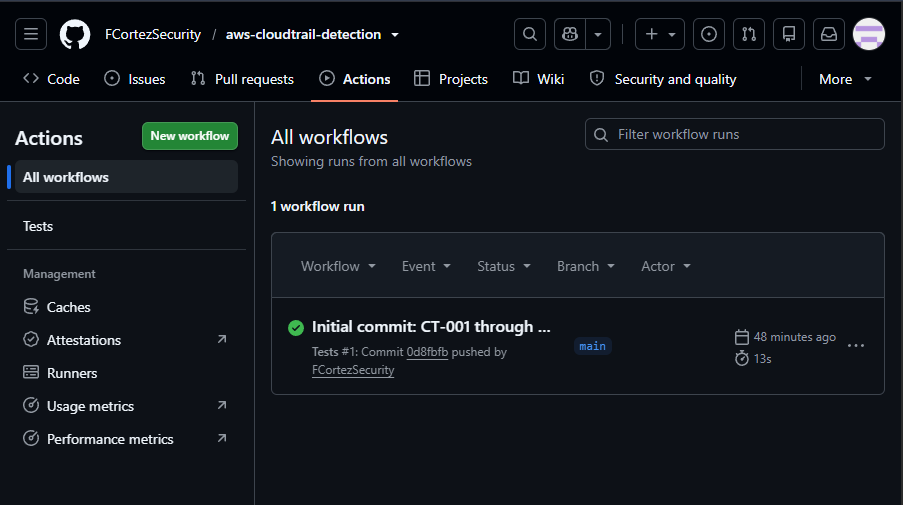

# AWS CloudTrail Detection Engine

A read-only Python/Boto3 tool that analyzes AWS CloudTrail activity to detect suspicious behavior in near real time — failed login patterns, sensitive IAM changes, off-hours activity, and deviations from an identity's normal behavioral baseline.



## Why I built this

My first project, [aws-iam-security-audit](https://github.com/FCortezSecurity/aws-iam-security-audit), answers "what's wrong with the current configuration?" — a static, point-in-time review of IAM. But misconfiguration is only half the story in cloud security. The other half is **behavior**: what's actually happening in the account, right now, over time.

This project is the deliberate next step in that direction. Where Project 1 is a snapshot, this one is a movie — it watches CloudTrail activity and asks a different set of questions: Is root being used when it shouldn't be? Did someone just brute-force their way into a console session? Did a sensitive IAM change happen at 3 AM on a Sunday? Has this identity ever done *this* before?

I built it the same way I built Project 1: one phase at a time, testing and understanding each piece before moving to the next, using a dedicated least-privilege IAM identity rather than admin credentials, and documenting the real bugs I hit rather than presenting a sanitized version of the process.

## Why this matters for security teams

Configuration audits (like Project 1) catch misconfigurations before they're exploited. Behavioral detection catches exploitation *while it's happening* — or soon after. A real security program needs both. This project demonstrates the core mechanics behind tools like GuardDuty, but built from first principles against raw CloudTrail data, which forces a real understanding of:

- How CloudTrail actually delivers events (and where it doesn't)
- The difference between a rule that fires on a single event vs. one that correlates a sequence of events over time
- Why "new" and "unusual" are hard to define precisely, and why over-alerting is its own kind of failure
- How to build detections that are honest about their limitations rather than overselling their certainty

Every finding this tool produces is explicitly framed as "this deviates from a pattern and deserves a human look" — never "this proves an attack." That framing discipline is itself a security-engineering skill: alert fatigue from overconfident tools is a well-documented real-world problem, and I designed around it deliberately rather than by accident.

## What it detects

| Rule | Description | Severity |
|------|-------------|----------|
| CT-001 | Root account activity | HIGH |
| CT-002 | Sensitive IAM changes (`CreateUser`, `DeleteUser`, `CreateAccessKey`, `AttachUserPolicy`, `AttachRolePolicy`, `PutUserPolicy`) | MEDIUM/HIGH |
| CT-003 | Failed → successful console login correlation (possible brute-force / credential stuffing) | MEDIUM |
| CT-004 | Sensitive IAM changes outside configured business hours | MEDIUM |
| CT-005 | New API action for an identity, relative to its persisted behavioral baseline | LOW |

Every finding includes the raw event details, a severity, an actor, and a plain-language recommendation for a human to investigate — this tool detects and recommends, it never remediates automatically.

## Example output

A single run against live CloudTrail data:



### CT-001 — Root Account Activity
Root should rarely be used for day-to-day operations. Every root action gets flagged HIGH, regardless of what it is — this is intentionally broad, see *Challenges* below for the real-world trade-off this creates.



### CT-002 — Sensitive IAM Change
A `CreateUser` call, flagged for review — not because it's inherently malicious, but because IAM changes are exactly the kind of action that deserves visibility.



### CT-003 — Failed → Successful Login Correlation
This is the rule I'm proudest of — it's the first one in this project that reasons about a *sequence* of events rather than judging one event in isolation. Two failed console logins followed by a success, for the same identity, within a 15-minute window:



### CT-004 — Off-Hours IAM Change
The same `CreateUser` event from CT-002 also trips CT-004, because it happened outside the configured business-hours window. One event, two independent rules, two different angles — proof the architecture supports layered detection without the rules stepping on each other.



### CT-005 — Behavioral Baseline Deviation
The tool builds and persists a baseline (`baseline.json`) of every action each identity has been observed taking. The very first run can't yet know what's "normal," so it silently learns instead of alerting:



A later run, once the baseline has real history, correctly flags a genuinely new action for that identity:



## Architecture

- **Read-only.** No remediation, no automatic changes — detect, recommend, human investigates and responds.
- **Least-privilege IAM identity** (`cloudtrail-detector`), with permissions added incrementally, one at a time, exactly when a new phase needed them — never broad "just in case" access.
- **Two data sources, deliberately.** `cloudtrail.lookup_events` handles general activity; CloudWatch Logs (`filter_log_events`, with full manual pagination) handles `ConsoleLogin` events specifically. This split isn't arbitrary — it's the direct result of a real bug described below.
- **Persisted baseline** (`baseline.json`, gitignored — it's environment state, not source code) tracks known actions per identity across runs, so CT-005 gets smarter over time instead of re-deriving history on every execution.
- **Configurable, not hardcoded.** Business hours, timezone, the login-correlation window, and the failure threshold are all named constants at the top of the file, matching the project's own design discipline: nothing security-relevant should be a magic number buried in logic.

## Setup

```bash
python -m venv venv
venv\Scripts\activate       # Windows
pip install -r requirements.txt
```

Create a dedicated, least-privilege IAM user (e.g. `cloudtrail-detector`) with an access key configured as an AWS CLI profile of the same name. See `iam-policy.json` for the exact permissions this tool needs — it grows in labeled phases (`CloudTrailReadOnlyPhase0`, `Phase1`, etc.) mirroring how the project itself was built.

Run it:
```bash
python src/detect_iam_changes.py
```

## Testing

```bash
pip install pytest
pytest tests/ -v
```



13 unit tests cover every rule's fire and no-fire conditions, using hand-built event fixtures based on real CloudTrail JSON shapes discovered during development. They make zero AWS calls — no cost, no flakiness, no dependency on CloudTrail's delivery delays — and run in well under a second.

Tests run automatically on every push via GitHub Actions:



## Challenges and how I solved them

This section is the honest record of what actually went wrong while building this — and I think it's the most useful part of the repo for anyone evaluating how I work through unfamiliar problems.

**`lookup_events` is unreliable for `ConsoleLogin` events.** While building CT-003, I could directly confirm — by manually searching CloudWatch Logs — that failed and successful login events existed and were correctly logged. But `cloudtrail.lookup_events`, even filtered to `EventName=ConsoleLogin` with a precise `StartTime`/`EndTime` window, simply didn't return them. This wasn't a delay; the events never appeared no matter how long I waited. *Solution:* CT-003 reads `ConsoleLogin` events directly from CloudWatch Logs instead, since that pipeline proved consistently reliable from Phase 0 onward. *Takeaway for anyone building on CloudTrail:* don't assume `lookup_events` is a complete picture of account activity — validate against a second source before trusting a "no results" answer, especially for security-sensitive event types.

**`ConsoleLogin` events don't carry a resolved ARN.** My first version of CT-003 keyed its correlation logic on `userIdentity.arn`, the same field every other rule uses. It worked by coincidence in testing (every event happened to resolve to the same value), but a login attempt — especially a failed one — isn't yet an authenticated session, so AWS never populates a full ARN for it. *Solution:* CT-003 correlates on `userIdentity.userName` instead, the one identity field CloudTrail reliably includes on both failed and successful login events. *Takeaway:* never assume a field present on one CloudTrail event type is present on all of them — the schema is deceptively inconsistent between event categories.

**`filter_log_events` silently paginates.** A single call to CloudWatch Logs' `filter_log_events` only returns one page of results via `nextToken` — without explicitly following that token in a loop, I was getting an empty-looking result back from a 20-hour window that actually contained over 800 real log entries. It looked exactly like "no matching data," when the real issue was "only 24 of 828 records fetched." *Solution:* wrapped the call in a `while` loop that follows `nextToken` until it's exhausted. *Takeaway:* any AWS API returning a list should be treated as paginated until proven otherwise — a clean, empty-looking result is not proof of an empty dataset.

**Windows has no built-in IANA timezone database.** CT-004's business-hours check uses Python's `zoneinfo` module, which relies on the OS to supply timezone data on Linux and macOS — but Windows provides no equivalent, so `ZoneInfo("America/Chicago")` failed with `ZoneInfoNotFoundError` the first time I ran it. *Solution:* added the `tzdata` package as an explicit dependency, which ships the timezone database directly. *Takeaway:* cross-platform Python code that touches timezones needs `tzdata` as a declared dependency, not an assumed one — this is exactly the kind of gap that passes silently on a developer's Mac and breaks in CI or on a teammate's Windows machine.

**CT-001 is very noisy in an actively-administered account.** Because this rule flags every single root action with no further qualification, in a sandbox where I was doing hands-on setup work via the root console, it fired on nearly everything — including completely routine, harmless reads. In a real production account where root is used rarely (as it should be), this rule would be rare and high-signal. Here, it's a demonstration of a real, honest limitation: the rule doesn't yet distinguish an MFA-authenticated, human-driven console session from a stale or leaked root credential being used programmatically, nor does it distinguish a read from a mutation. I'm documenting this rather than hiding it, because recognizing when a detection rule needs more nuance — and knowing exactly what that nuance would be — is a more valuable skill to demonstrate than pretending the first version was perfect.

## Roadmap

- [x] Phase 0–5: CloudTrail setup, CT-001 through CT-004 (V1)
- [x] Phase 6: Behavioral baseline, CT-005 (V2 core slice)
- [x] Phase 7 (partial): automated tests, CI via GitHub Actions
- [ ] Extend CT-005 with region and time-of-day baseline dimensions, not just action name
- [ ] MFA-awareness for CT-001, to separate authenticated human root sessions from unauthenticated/programmatic ones
- [ ] Alert integration (SNS/Slack) — notify a human when a finding occurs, rather than requiring someone to run the script and read console output
- [ ] Detection-as-code refinements: severity tuning based on real-world false-positive rate, once this runs against a busier account over time

## Related project

[aws-iam-security-audit](https://github.com/FCortezSecurity/aws-iam-security-audit) — the static IAM configuration audit that this project's approach builds on. Together they cover both halves of the picture: what's misconfigured, and what's actually happening.